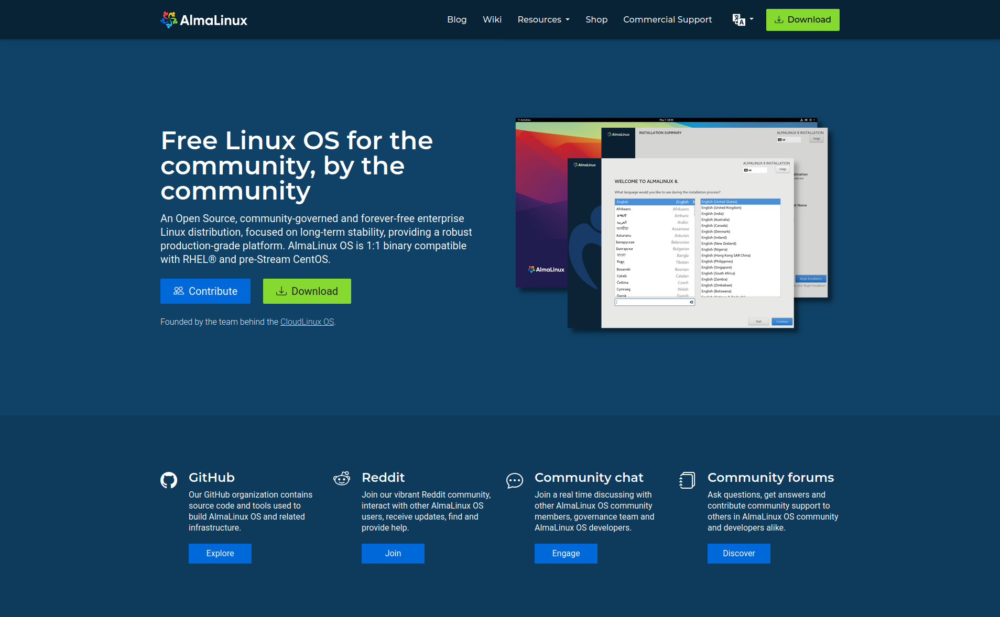

# almalinux.org website

[](https://almalinux.org)

This repository contains the source code for the AlmaLinux website at [https://almalinux.org](https://almalinux.org).

The site is built using the [Hugo](https://gohugo.io/) static site generator.

## Contributing

We welcome contributions for website updates, design improvements, and translations. Please follow the specific instructions provided for each contribution type:

- For blog content, see [Contributing - Blog Posts](https://github.com/AlmaLinux/almalinux.org/blob/main/contributing-blog-posts.md)
- For newsletter issues, see [Contributing - Newsletters](#contributing---newsletters)
- For event pages, see [Contributing - Event Pages](#contributing-event-pages)
- For code or design improvements, see [Contributing - Code and Design](#contributing-code-and-design)
- For translations, see [Contributing - Translations](#localization-and-translation)

## Contributing - Event Pages

Event landing pages (AlmaLinux Day, ALDT, etc.) use the `event-day` Hugo layout. A new event page requires only two files — no HTML editing needed.

### Step 1: Create the content file

Create `content/your-event-slug.md`:

```yaml
---
title: "AlmaLinux Day: City Year"
type: event-day
images:
  - /images/og/your-og-image.png

# Hero banner
hero_image: "/landingpages/your-event/hero.jpg"
event_name: "AlmaLinux Day: City"
event_tagline: "Optional tagline" # omit if not needed
event_date: "Month Nth, YYYY"
event_time: "HH:MM AM – HH:MM PM" # optional; shown below the date
venue:
  - "Venue Name"
  - "Street Address"
  - "City, Country"
venue_link: "https://maps-or-transit-link"
venue_link_text: "Getting here"
registration_url: "https://events.almalinux.org/e/your-event"
registration_cta: "Reserve your spot!"
registration_button: "al-cta-green" # or al-cta-blue

# Post-event — set to true and fill in after the event
post_event: false
thankyou_city: "City"
thankyou_quote: "Quote from benny after the event."
thankyou_youtube: "https://www.youtube.com/watch?v=..."

# Footer bars — omit either field to hide that bar
coc_url: "/p/your-event-code-of-conduct/"
photo_credit_name: "Photographer Name"
photo_credit_url: "https://unsplash.com/..."

# Must match the filename in data/events/ (without .yaml)
event_data_key: "your-event-slug"
speakers_header: "On stage at AlmaLinux Day: City" # optional; overrides default heading
---
```

The markdown body (below `---`) is rendered between the hero and the speakers section. Use it for the event description, schedule embed, venue photos, and any other event-specific content. Raw HTML is supported.

### Step 2: Create the data file

Create `data/events/your-event-slug.yaml`:

```yaml
event_sponsors:
  - name: "Sponsor Name"
    url: "https://sponsor.example.com"
    logo: "/brands/sponsor-logo.svg"
    size: "large" # "large" = prominent; omit for smaller display

speakers:
  - name: "Speaker Name"
    photo: "/landingpages/your-event/speaker.jpg"
    title: "Speaker Title or Talk Title" # optional
    org: "Speaker Organization" # optional
```

### Step 3: Add images

- Hero image → `static/landingpages/your-event/`
- Speaker photos → `static/landingpages/your-event/` (or anywhere under `static/`)
- OG/social preview image → `static/images/og/`

### Step 4: Add to the navigation menu

Add the new event to `layouts/partials/common/nav.html`, inside the Events dropdown under the "Upcoming Events" header. Events are listed newest-first. Once the event has passed, move it under the "Past Events" header. Add a new `<li>`:

```html
<li>
  <a
    class="dropdown-item"
    href="{{ "/your-event-slug/" | relLangURL }}"
    style="color:aliceblue">
    {{ i18n "ALD City YYYY" }}
  </a>
</li>
```

### Toggling post-event state

Once the event is over, set `post_event: true` in the front matter and fill in `thankyou_quote` and `thankyou_youtube`. This automatically shows the thank-you block at the top of the page with a link to the recordings.

### Foundation member sponsors

The foundation member sponsor logos are rendered automatically on every event page — you do not need to add them. To update the list, edit `layouts/partials/common/foundation-members.html`.

## Contributing - Newsletters

Newsletter issues are published by the [Marketing SIG](https://wiki.almalinux.org/sigs/Marketing.html) as markdown files in `content/newsletters/`. Each file maps to a single newsletter issue.

### Step 1: Create the content file

Create a new file in `content/newsletters/` named `YYYY-MM-DD-almalinux-news-month-YY.md`, where the date is the publish date:

```markdown
---
title: "AlmaLinux News for Month 'YY"
type: newsletters
date: "YYYY-MM-DD"
summary: "One-sentence summary shown on the newsletters listing page."
image: /newsletter-images/mon-yy.png
draft: false
---

Your newsletter content here in Markdown.
```

**Front matter fields:**

| Field     | Description                                                                   |
| --------- | ----------------------------------------------------------------------------- |
| `title`   | Displayed as the issue heading. Format: `AlmaLinux News for Month 'YY`        |
| `type`    | Must be `newsletters`                                                         |
| `date`    | Publish date in `YYYY-MM-DD` format — controls sort order on the listing page |
| `summary` | Short description shown on the listing page under the title                   |
| `image`   | Path to the newsletter header image (see Step 2)                              |
| `draft`   | Set to `false` to publish, `true` to hide                                     |

### Step 2: Add a header image

Add a header image at `static/newsletter-images/mon-yy.png` (e.g. `jan-26.png`). The image should be 1200×630px.

### Step 3: Open a pull request

Open a PR targeting the `main` branch. Once merged, the newsletter will appear on the [newsletters listing page](https://almalinux.org/newsletters/) under its year, and will be included in the RSS feed automatically.

## Contributing - Code and Design

All development for the AlmaLinux website happens through this repository on GitHub.

### Reporting a Bug

Clear and detailed bug reports are incredibly valuable. A bug is a reproducible problem affecting the code or site functionality.

Please check the [GitHub issues](https://github.com/AlmaLinux/almalinux.org/issues) to see if your issue has already been reported. A good bug report should include as many details as possible to avoid unnecessary follow-ups.

### Requesting a Feature

1. [Search existing issues](https://github.com/AlmaLinux/almalinux.org/issues) to see if the feature has already been requested. If so, give it a thumbs up or +1.
2. If no similar request exists, open a new issue. Please clearly explain why the feature is needed and provide a detailed use case.

### Contributing Code or Design Changes

Before submitting code changes, please check if there are any open issues or pull requests that cover your proposal. If not, open an [issue](https://github.com/AlmaLinux/almalinux.org/issues) with a brief description and discuss it with the Marketing SIG first.

This helps avoid duplicated work and ensures proposed changes align with project goals.

For smaller contributions, follow this workflow:

- Create an [issue](https://github.com/AlmaLinux/almalinux.org/issues) describing your changes.
- Await confirmation from contributors.
- Fork the project.
- Create a new branch for your feature or bug fix.
- Add your code, documentation, etc.
- Submit a pull request (PR). All PRs should target the `main` branch. Once approved, a development site will automatically generate based on the PR.

After review and approval, the changes will be merged into the `main` branch and deployed to the live site.

### For Developers

#### Local Development

To set up a local development environment, you need the following installed:

- Hugo

Run `hugo server` to start a near-production local development instance.

After cloning, run `npm install` to install dependencies. This sets up the pre-commit hook (via [husky](https://typicode.github.io/husky/)) that automatically runs [Prettier](https://prettier.io/) on staged files before each commit, keeping formatting consistent with CI.

Localization is important! Please include proper localization formatting in your PR. After formatting, run `find_missing_i18n_strings.py` and `setup-pages-for-supported-languages.py`, then commit the changes. If you encounter issues with these scripts, please open an [issue](https://github.com/AlmaLinux/almalinux.org/issues) with details.

#### Container Development

To use a container-based development environment, install Docker and use an editor supporting the devcontainer standard. Details can be found in the [README](.devcontainer/README.md).

#### Project Structure

- `/layouts/` — Hugo HTML templates
- `/layouts/partial` — Shared templates (header, footer, etc.)
- `/i18n/` — Localization and translation files
- `/static/` — Static files
- `/content/` — Markdown content for site pages
- `/data/` — Source data, currently only for the "Get AlmaLinux" page
- `config.yaml` — Hugo configuration
- `find_missing_i18n_strings.py` — Detects untranslated strings in `i18n/en.json`
- `setup-pages-for-supported-languages.py` — Creates placeholder markdown pages for missing languages

#### Updating 'Get AlmaLinux' page

The "Get AlmaLinux" page is dynamically generated using structured data and Hugo partial templates. This section explains how the data flows, which files are involved, and how to update the page for new releases or changes.

**How it works:**

- **Data sources:**
  - `data/get_almalinux_spec.yaml`: Defines available AlmaLinux versions, supported architectures, and the configuration for
    each section (e.g., ISO, Cloud, Container).
  - `data/get_almalinux_checksums.yaml`: Contains, for each version, the current highest point release (`fullVersion`) and the
    checksums for all artifacts (ISOs and cloud images) per architecture. This file can (and probably will) be generated.

- **Generation script:**
  - The script `tools/generate_get_almalinux_checksums.py` reads `data/get_almalinux_spec.yaml`, queries
    the CHECKSUM URLs defined for ISO and Cloud images, extracts the checksums and the current minor release
    and produces `data/get_almalinux_checksums.yaml`.
  - The script `tools/generate_get_almalinux_yaml.py` reads both YAML files, merges their data, and produces `data/get_almalinux.yaml`. This merged file is used by the Hugo partials to render the page.
  - `data/get_almalinux.yaml` is **not** tracked in git. It is generated automatically by the GitHub CI workflow during site builds, but you must run the script manually for local development if you change the source YAML files.

- **Templates:**
  - Hugo partials in `layouts/partials/get-almalinux/` render the page:
    - `tabs.html`: Renders version tabs and architecture dropdowns.
    - `tab-content.html`: Generates the content for each tab panel.
    - `arch-sections.html`: Generates the page for each version+architecture combination.
    - `section-*.html`: Renders each section (ISO, Cloud, Container, etc.) that makes up a full page.

##### Editing for a New Point Release

**In most cases, you only need to update `get_almalinux_checksums.yaml` when a new point release is available.**

1. Run the checksum generation script to update `get_almalinux_checksums.yaml` by looking at the source repos:
   ```bash
   python3 tools/generate_get_almalinux_checksums.py
   ```
2. Optionally, run the generation script to see your changes locally:
   ```bash
   python3 tools/generate_get_almalinux_yaml.py
   ```
   This updates `data/get_almalinux.yaml` for use by Hugo.
   This will be done automatically by the Gitlab CI scripts during deployment.
3. Commit the resulting changes to `data/get_almalinux_checksums.yaml` and open a PR.

##### Editing Sections, Architectures, or URL Patterns

If you need to change which sections or architectures are shown, or adjust how URLs are generated, edit `data/get_almalinux_spec.yaml`:

- The YAML file contains a `common` block, which sets default configuration for each section. These defaults are merged with per-version overrides in the `versions` array.
- Each version entry includes:
  - `id`: The major version (e.g., `10`, `10-kitten`).
  - `label`: The tab title.
  - `arches`: List of supported architectures (becomes dropdowns in the page).
  - `sections`: List of sections to configure for that version.
- Each section (such as `iso` or `cloud`) can inherit from `common` but may be overridden per version or architecture.
  - A section may have its own `arches` array to restrict it to certain architectures. For example, if cloud images for AlmaLinux 10 on `ppc64le` are not supported, the `cloud` section's `arches` array should exclude `ppc64le`.
  - To remove a section entirely for a version, omit it from the version's `sections` list.
  - To remove a specific cloud image within the `cloud` section, define it with no content (see the `oci` section in 10-kitten as an example).

##### URL Patterns and Variables

Most sections define URL templates for artifacts, using variables such as:

- `major`: The major version, from `id` (e.g., `10`, `10-kitten`).
- `full`: The full version, from `fullVersion` in `get_almalinux_checksums.yaml` (e.g., `10.1`). If `fullVersion` is not set, it falls back to `id`.
- `arch`: The architecture (e.g., `x86_64`, `x86_64_v2`).

Some URLs may allow other variables (like `variant`), or require different patterns per architecture (e.g., `vagrant`'s `registryUrls`). For advanced options, consult the code in `tools/generate_get_almalinux_yaml.py`.

##### Summary of Workflow

1. Edit `get_almalinux_checksums.yaml` for new point releases, or `get_almalinux_spec.yaml` for section/architecture changes.
2. Run the generation script to update the merged YAML:
   ```bash
   python3 tools/generate_get_almalinux_yaml.py
   ```
3. Start or restart the Hugo server to see your changes locally.

If you have questions about advanced configuration or variable support, refer to the script or open an issue for help.

#### Prettier errors

Sometimes, prettier will fail with very unhelpful errors, such as:

```
[error] layouts/almalinux-day-tokyo-2026/single.html: Error: An error occured during printing. Found invalid node root.
[error]     at Object.print (/home/runner/work/almalinux.org/almalinux.org/node_modules/prettier-plugin-go-template/lib/index.js:65:19)
[error]     at callPluginPrintFunction (file:///home/runner/work/almalinux.org/almalinux.org/node_modules/prettier/index.mjs:16929:20)
[error]     at printAstToDoc (file:///home/runner/work/almalinux.org/almalinux.org/node_modules/prettier/index.mjs:16876:22)
[error]     at async coreFormat (file:///home/runner/work/almalinux.org/almalinux.org/node_modules/prettier/index.mjs:17294:14)
[error]     at async formatWithCursor (file:///home/runner/work/almalinux.org/almalinux.org/node_modules/prettier/index.mjs:17504:14)
[error]     at async formatFiles (file:///home/runner/work/almalinux.org/almalinux.org/node_modules/prettier/internal/legacy-cli.mjs:4279:18)
[error]     at async main (file:///home/runner/work/almalinux.org/almalinux.org/node_modules/prettier/internal/legacy-cli.mjs:4698:5)
[error]     at async Module.run (file:///home/runner/work/almalinux.org/almalinux.org/node_modules/prettier/internal/legacy-cli.mjs:4641:5)
```

The real error is being hidden by the `go-template` plugin, so the best way of figuring out what the problem is is by disabling it temporarily.

In your local checkout, edit `.prettierrc` and edit it so `go-template` isn't applied. For example, by changing the like this:

```
{
  "bracketSameLine": true,
  "plugins": ["prettier-plugin-go-template"],
  "overrides": [
    {
      "files": ["*.html-not-today-my-friend"],
      "options": {
        "parser": "go-template"
      }
    }
  ]
}
```

With that change done, you'll now get a different error when you run `prettier` locally:

```bash
> prettier layouts/almalinux-day-tokyo-2026/single.html
layouts/almalinux-day-tokyo-2026/single.html
[error] layouts/almalinux-day-tokyo-2026/single.html: SyntaxError: Unexpected closing tag "section". It may happen when the tag has already been closed by another tag. For more info see https://www.w3.org/TR/html5/syntax.html#closing-elements-that-have-implied-end-tags (858:7)
[error]   856 |         </div>
[error]   857 | end Attribution block -->
[error] > 858 |       </section>
[error]       |       ^^^^^^^^^^
[error]   859 |     </div>
[error]   860 |   </section>
[error]   861 | {{ end }}
```

Still not a great error, but it's better than before. In this particular case, you now know that `section` was already closed so the HTML is malformed somehow. Sometimes it's relatively easy to spot how because the offending tag is nearby, sometimes it's not. In this particular example, there were two unclosed `divs` in line 148, so it was NOT easy to spot. AI is remarkibly good at parsing HTML and actually giving you a better error than prettier, so you can give it the file and the prettier error and ask it to find the error.

Once you figure out the issue and fix it, undo your changes to `.prettierrc` and run it on the file again to verify that it's all good.

### Localization and Translation

AlmaLinux.org translations are managed on [Weblate](https://hosted.weblate.org/engage/almalinux/). To contribute, join the [AlmaLinux project](https://hosted.weblate.org/projects/almalinux/) on Weblate. Submissions through Weblate generate automated PRs to this repo, which are reviewed and merged by the Marketing SIG or another team lead.

For translation guidelines, see [our Wiki](https://wiki.almalinux.org/Help-translating-site.html).

To request a new language, open an issue in [GitHub issues](https://github.com/AlmaLinux/almalinux.org/issues).

[](https://hosted.weblate.org/engage/almalinux/)

### Change Approval Process

- Minor or cosmetic changes (typos, small style tweaks) can be reviewed and approved by any contributor with merge rights.
- Non-cosmetic changes require approval from the Marketing Lead.
- Weblate automatically submits PRs for translated strings; these are reviewed and merged by the Marketing SIG or team leads.
